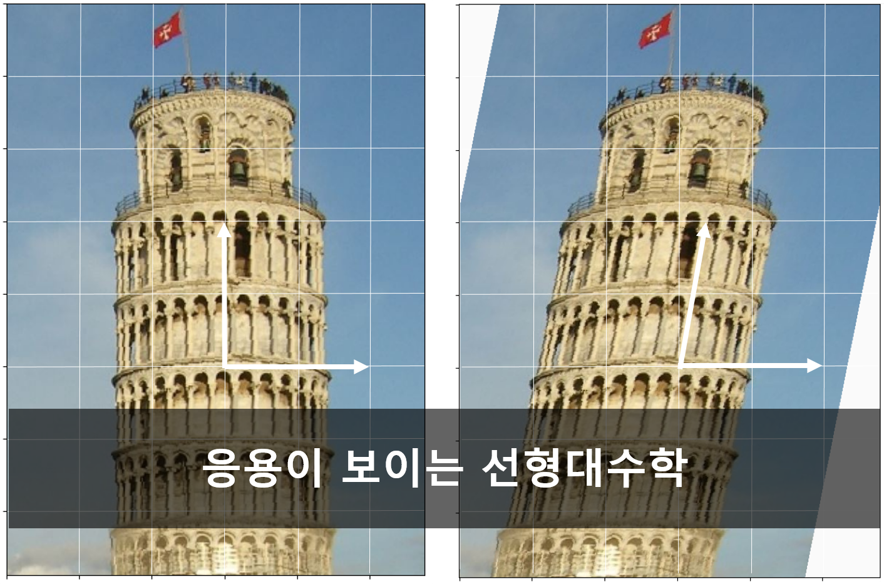

# 응용이 보이는 선형대수학 
저자: 이건명  |   출판사: 한빛출판 (2020) 

## 책에 대한 소개
공학분야 대부분의 전공에 선형대수학이 기초 수학으로 교과과정에 있다. 그럼에도 불구하고 많은 학생들이 선형대수학을 공부할 때 흥미를 느끼지 못하고 번거로운 계산만 하고 있다는 인상을 갖게 된다.

이는 선형대수학을 처음 접할 때 지나치게 수학적인 면만이 강조되기 때문이 아닐까 한다. 아는 만큼 보인다는 말처럼, 선형대수학에 대한 이해가 깊어질수록 공학적 도구로서의 가치가 보이고 활용도가 커지게 된다. 특히 순수하게 수학적 관점에서 학습하는 것보다는 해당 전공의 활용 관점에서 선형대수학을 다룬다면 흥미와 함께 이해도가 심화될 수 있다. 이 책은 머신러닝, 데이터 분석과 처리 등을 학습하려는 학생 및 연구자들을 대상으로 기획되었다. 
 
도구로 활용하는 전공자들이 선형대수학을 연산 방법 위주로 학습하는 것은 바람직하지 않다. 개념과 의미를 명확히 이해하여 관련된 성질을 확인하고 활용 방법을 파악해야 한다. 연산 방법에 따라 계산을 해보는 것은 연산 방법과 성질을 이해하기 위한 목적으로 필요하다. 도구로서 선형대수학 기법을 활용할 때는 일반적으로 큰 행렬이나 벡터를 대상으로 하기 때문에 컴퓨터 프로그램으로 연산을 수행하게 된다. 따라서 선형대수학의 학습은 개념과 의미 및 성질의 이해, 그리고 활용 대상 및 방법을 아는 것을 목표로 하는 것이 바람직하다. 

이 책은 공학적 활용 관점에서 선형대수학의 전체적인 큰 그림을 볼 수 있도록 구성되어 있다. 각 주제별로 개념에 대한 정의, 정의를 기반으로 유도는 정리에 대한 증명을 제시하고, 활용 대상과 방법을 소개한다. 정의 및 정리 별로 예제를 제시하여 관련된 개념과 성질을 쉽게 이해할 수 있도록 하고, 정리 별로 증명을 제시한다. 공학분야 선형대수학에서 증명을 생략하는 경향이 있으나, 증명 없이 정리를 사용하는 것은 온당한 학습 태도는 아니다. 고급 이론이 필요한 몇 개를 제외한 모든 정리에 증명을 제시하고 있다. 증명을 직접 하지 않더라도 증명을 한번 읽어보는 것 만으로도 해당 정리를 사용하는 데 마음의 부담은 없을 것이다. 

이 책이 다루는 범위는 선형대수학의 기본 과정에서 다루는 것보다는 다소 넓다. 이는 응용 및 활용 방법에 대한 주제가 포함된 것이 한 가지 이유이고, 증명하고 문제풀이 하는 보통의 수학이 아니라 직접 활용하기 위한 파이썬 프로그래밍 사례를 포함하고 있기 때문이다. 기초 과정에서는 일부 주제를 건너뛰는 것이 필요할 듯하다. 연습문제 풀이와 프로그래밍 실습을 병행하면 효과적일 것으로 기대된다.

## Repo에 대한 소개
이 Repo는 "응용이 보이는 선형대수학"의 프로그래밍 실습 코드와 본문 보완 내용 및 보조 자료 등을 제공하는 페이지입니다. 본문 보완 내용은 [Corrections](./Corrections)에서, 각 장의 프로그래밍 실습 코드와 보조 자료는 [Practice Code](./Practice-Code)에서 찾을 수 있습니다. 

## 목차
- **Chapter 01: 선형대수학의 개요**
  - 1.1 기본적인 수학 개념
  - 1.2 선형대수학의 범위
  - 1.3 선형대수학의 응용
- **Chapter 02: 선형방정식**
  - 2.1 연립선형방정식
  - 2.2 연립선형방정식의 풀이법
  - 2.3 연립선형방정식의 응용
- **Chapter 03: 행렬**
  - 3.1 행렬
  - 3.2 행렬의 연산
  - 3.3 역행렬
  - 3.4 특별한 행렬
- **Chapter 04: 역행렬**
  - 4.1 역행렬의 계산
  - 4.2 역행렬의 활용
  - 4.3 LU 분해
  - 4.4 블록행렬의 역행렬
- **Chapter 05: 행렬식**
  - 5.1 행렬식
  - 5.2 행렬식의 성질
  - 5.3 블록행렬의 행렬식
  - 5.4 행렬식의 기하학적 의미
  - 5.5 행렬식의 활용
- **Chapter 06: 벡터**
  - 6.1 벡터 
  - 6.2 벡터공간
  - 6.3 벡터의 내적
  - 6.4 벡터의 외적
  - 6.5 벡터와 기하학
  - 6.6 벡터와 행렬 미분
- **Chapter 07: 선형변환**
  - 7.1 선형변환
  - 7.2 선형변환의 부분공간과 계수
- **Chapter 08: 고윳값과 고유벡터**
  - 8.1 고윳값고 고유벡터
  - 8.2 고윳값과 고유벡터의 성질
  - 8.3 고윳값과 고유벡터의 응용
- **Chapter 09: 직교성**
  - 9.1 직교기저
  - 9.2 직교분해
  - 9.3 행렬방정식의 최소제곱해와 최적근사해
  - 9.4 직교성의 응용
- **Chapter 10: 대각화와 대칭**
  - 10.1 닮음과 대각화
  - 10.2 대칭행렬
  - 10.3 이차형식
  - 10.4 대칭행렬의 응용
- **Chapter 11: 특잇값 분해**
  - 11.1 특잇값 분해
  - 11.2 특잇값 분해의 응용

